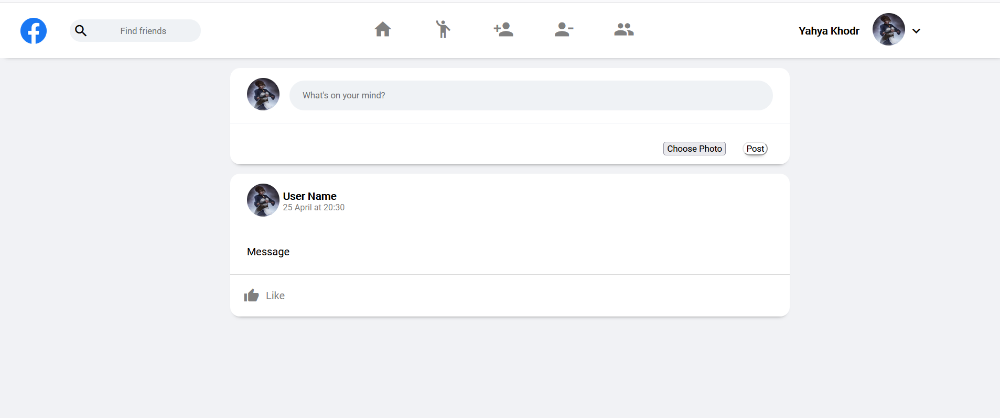

# Facebook Mockup Website

Simple social website like facebook 
##  SCREENS

## 💡 TOOLS & Languages 
- PHP & MySQL
- JavaScript HTML5/CSS3
- Material Icons Library
- IDE (Vs code)
- Git Version Control
- XAMPP 
- FIGMA (UI/UX)

## ✅ Lessons Learned
- Implementing APIs using Php
- Writing queries in MySQL Database
- Link Backend to Frontend
- Github branches for Team Work
- How to deal with OOP(Object Oriented Programming ) with php and mysqli
- Security With Hashing and Encrypting

## 🚀 Getting Started
- User have to create an account and pick a profile image to be able to login
- User can add new status.
- User can check his friends list
- User can check friends requests from other users
- User can check his blocked list.
  

## 👥 Collaborators
  - BILAL ACHI [Github](https://github.com/Bilalachi)
  - YAHYA KHODR [Github](https://github.com/Yahya-khodr)

### SE Factory Group Project (2022)

